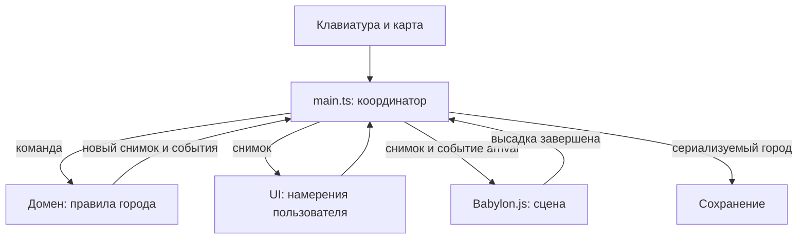

# Архитектура

Цель: новую экономическую механику можно проверить без видеокарты, а вид города — поменять без изменения правил заселения.

## Поток данных



`main.ts` знает обо всех модулях и соединяет их. Остальные модули не ищут друг друга в глобальных переменных. У домена нет зависимости от DOM, таймеров, localStorage или Babylon.js. Сцена получает функции географии через параметр `board`, а не импортирует внутреннее устройство игры.

## Границы

| Модуль | Публичный интерфейс | Чем владеет | Чего не делает |
| --- | --- | --- | --- |
| `domain/index.ts` | `createGame`, данные каталога, география, загрузка состояния | Население, деньги, здания, шаг обучения, допустимость действий | Не рисует и не сохраняет файл |
| Объект игры | `dispatch(command)`, `snapshot()`, `serialize()` | Единственное изменяемое состояние города | Не отдаёт наружу изменяемые ссылки |
| `persistence/index.ts` | `createStorage(getStorage)` → `load`, `save`, `loadSettings`, `saveSettings` | Доступ к сохранению и сообщения об ошибках | Не решает, сколько жителей приехало |
| `ui/index.ts` | `createUI(...)` → `render`, `notify`, `saveStatus`, `dispose` | DOM и обработчики кнопок | Не списывает стоимость строительства |
| `objects/index.ts` | `objectTemplate`, `parseObjectTemplates`, `setObjectTemplates` | Версионированные конфигурации и проверка | Не обращается к браузерному хранилищу |
| `editor/` | `npm run editor`, локальные `/api/project` и `/api/save` | UI, библиотека, локальный HTTP и Git-сохранение | Не входит в игровой bundle |
| `input/index.ts` | `bindInput(...)` → функция отключения | Различение клика и перетаскивания | Не решает, разрешено ли строить |
| `scene/index.ts` | `createScene(...)` → `setModel`, `playArrival`, `setPaused`, `setSettings`, `reset`, камера, `pick`, `dispose` | Babylon.js, GPU-ресурсы, кадры, подсветка | Не меняет население и казну |

Файлы внутри папки могут импортировать друг друга. Соседний слой использует только `index.ts`. Этот договор проверяет `tests/architecture.test.js`.

## Главное меню, пауза и настройки

`ui/menu.ts` экспортируется через `ui/index.ts`. Он управляет главным меню, диалогами паузы, настроек и подтверждения сброса. Сам город не изменяет: намерения `start`, `restart`, `pause`, `settings` получает координатор. `createUI` по-прежнему рисует игровой интерфейс, помощь и финальное письмо.

Фон меню — `assets/art/main-menu-loop.mp4`: бесшумный 15-секундный ролик, 48 кадров/с: стабильный участок первого исходника проходит вперёд и назад с мягкими разворотами. Замедление задаётся в `ui/menu-background.ts` через `defaultPlaybackRate` и `playbackRate = 0.5`: проход туда и обратно занимает 30 секунд, при показе получается 24 кадра/с. Лёгкое размытие задаётся CSS-переменной `--menu-art-blur` и применяется только к видео. `scripts/build.mjs` встраивает видео и исходную иллюстрацию `assets/art/main-menu.webp` как data URL; сетевых запросов нет. `ui/menu-background.ts` запускает видео только в видимом главном меню, если разрешена анимация и не включён `prefers-reduced-motion`. Контроллер фона обрабатывает захват указателя только за пределами карточки меню, переводит горизонтальное смещение в ракурс на ограниченной дуге с учётом замедления у концов и использует инвертированное управление: жест вправо увеличивает положение на дуге и выбирает прямую половину видео, жест влево уменьшает положение и выбирает обратную. Через 5 секунд после отпускания проигрывание продолжается с выбранного места и в выбранную сторону. Таймер отменяется при деактивации и уничтожении контроллера. `ui/menu.ts` задаёт активность фона при переходах между экранами. При входе в игру и скрытии вкладки видео останавливается; при ошибке остаётся иллюстрация. Исходный ответ генератора сохранён отдельно как `assets/art/main-menu-source.mp4`. Название игры, описание, прогресс и кнопки собраны в одной бумажной карточке. На экранах от 1000 px карточка расположена справа с отступом от края, оставляя центр для острова; на узких экранах она центрируется. Оба слова заголовка используют единый шрифт и начертание; текст не накладывается непосредственно на иллюстрацию. Фон слегка тонируется через `--menu-art-overlay` в теме. Карточка остаётся HTML, игровые модели не меняются. Промпт и визуальные ориентиры сохранены в `assets/art/README.md`.

При загрузке координатор читает город и настройки, но не создаёт сцену и не подключает игровой ввод. До нажатия «Новая игра» / «Продолжить» нет ни WebGL-контекста, ни цикла кадров. Первый вход создаёт сцену, последующие используют её же. Валидный сохранённый город или первый успешный вход дают подпись «Продолжить». Само чтение меню ничего не записывает в сохранение.

На паузе игровой ввод отключается, `setPaused(true)` отменяет цикл кадров. Возобновление сдвигает начало рейса на длительность паузы; население и доход не пересчитываются. Меню, открытое поверх города, и выход в главное меню используют один механизм. Сцену не уничтожаем, поэтому сохраняются камера и положение корабля. Диалоги обрабатывают Escape от верхнего уровня: подтверждение → настройки → пауза → город.

Настройки хранятся под отдельным ключом `quiet-harbor-settings-v1`; версия и ключ города не меняются. `GameSettings` описывает качество графики, декоративную анимацию и подсказки. `setSettings` меняет плотность пикселей, частоту кадров и анимацию сцены, а `data-hints` на `body` управляет письмами после обучения. Цели и финальное действие не скрываются. Сброс города не сбрасывает настройки. Повреждённые настройки возвращают значения по умолчанию; запрет записи выводит предупреждение.

## Команды и события

Команда выражает намерение, а не гарантированное изменение:

```js
{ type: 'select', building: 'house' }
{ type: 'build', x: 7, z: 6 }
{ type: 'next-day' }
{ type: 'continue' }
{ type: 'reset' }
{ type: 'arrival-finished' }
```

`dispatch` возвращает `{ changed, events }`. `changed` означает изменение сохраняемого города. Выбор карточки меняет интерфейс, но не требует записи на диск. Ошибка размещения возвращает событие `notice`, не повреждая состояние.

`arrival` содержит число пассажиров и координаты порта. Это сообщение домена сцене: «покажи произошедшее». В обратную сторону идёт только `arrival-finished`: «анимация закончилась, можно продолжать».

## Три вида состояния

1. **Постоянное:** день, деньги, еда, население, здания, обучение, летопись. Попадает в `serialize()`.
2. **Сеансовое:** выбранная карточка и блокировка действий на время рейса. Живёт внутри объекта игры, но не в сохранении.
3. **Визуальное:** положение камеры, подсвеченная клетка, секунды анимации. Живёт только в сцене и input.

Число жителей увеличивается до начала визуальной высадки. Затем состояние сразу сохраняется. Поэтому перезагрузка во время анимации показывает уже заселившийся город, не повторяет начисление и не оставляет кнопку дня заблокированной.

## Графика и ресурсы

`geometry.ts` собирает здания из деталей Kenney и создаёт `VertexData`, который применяется к Babylon Mesh. Геометрия острова обновляется только после изменения построек. Корабль — отдельный `Mesh`, его движение не требует пересборки острова. При замене геометрии старая освобождается через `dispose()`. Первый кадр повторяется до готовности асинхронно компилируемых шейдеров; после этого при выключенной анимации неподвижная сцена перерисовывается только при изменениях.

`pack-assets.mjs` переносит цвет палитры по UV каждого угла треугольника: запись грани содержит три индекса позиций и три индекса цветов. Видеокарта интерполирует цвета вершин, сохраняя плавные градиенты без однотонных треугольных пятен. Общий сборщик геометрии применяет это и в игре, и в мастерской; мастерская сохраняет запечённый свет, а игра использует реальные источники, корректные нормали правой системы координат и выборочное сглаживание близких граней. Исходные OBJ и текстуры не меняются.

`voyage.ts` считает положение по прошедшему времени. Он не знает ни о браузере, ни о жителях в сохранении. `life.ts` держит фиксированный пул 3D-фигур пассажиров и жителей, а также дым. Фигуры учитывают глубину сцены. Это декоративный слой, не полноценная логистика. Свет маяка рисуется на прозрачном 2D-слое; вода и её блики полностью трёхмерные.

`window.cityDebug` — узкий диагностический интерфейс только для чтения. Он возвращает копии и помогает сквозным тестам найти клетку на экране; приложение не использует его для общения модулей.

`scene/camera.ts` хранит текущий и целевой ракурсы, центр орбиты и независимые источники удерживаемого ввода. Скорости считаются по времени кадра, переход к цели — экспоненциальный; поворот не привязан к фиксированным углам. `scene/index.ts` обновляет камеру до ограничения частоты декоративных кадров, поэтому ручное движение остаётся плавным. Камера остаётся над поверхностью и допускает взгляд в небо, масштаб — диапазоном 0,55–3. Панорамирование меняет центр орбиты в плоскости земли с учётом текущего ракурса и масштаба.

`input/index.ts` переводит физические коды клавиш и жесты на холсте в команды камеры, не перехватывая ввод в диалогах и полях. Правая кнопка вращает и наклоняет, левая перемещает; только короткое нажатие левой строит объект. Потеря фокуса, скрытие страницы и пауза отменяют удержание. SVG панели камеры формируются из Lucide при сборке в `camera-icons.json`; React в браузере не нужен. Положение камеры доступно в `cityDebug.camera` для проверок, не сохраняется вместе с городом и не сбрасывается прибытием корабля.

## История и гавань

Необязательное вступление отделено от домена: `ui/intro.ts` владеет модальным экраном, индексом кадра и единственным HTMLAudioElement. `ui/menu.ts` открывает его и скрывает только карточку меню; существующее фоновое видео продолжает работать. Окончание MP3 не меняет индекс: следующий кадр выбирает пользователь. Выход синхронно останавливает голос, очищает источник и возвращает фокус кнопке вступления. Скрытие вкладки ставит голос на паузу без автоматического возобновления.

`assets/audio/marta-intro/frames.json` связывает текст, названия кадров и отдельные MP3, полученные из исходных сегментов озвучки. `scripts/pack-intro.mjs` проверяет манифест и создаёт типизированный JSON с data URL в `.generated/`; его вызывают сборка и отдельная проверка типов. Портрет встраивается сборкой из `assets/art/marta-portrait.webp`. Ни один ресурс вступления не загружается из сети.

Тот же упаковщик рендерит выбранные иконки `lucide-react` через React DOM Server в `.generated/intro-icons.json`. В браузер попадают только строки SVG; React не участвует в работе игры. При переходе `ui/intro.ts` создаёт временную неинтерактивную копию предыдущего листа без ID и анимирует её Web Animations API. Быстрый переход, выход или скрытие вкладки отменяют прежнюю анимацию; `prefers-reduced-motion` отключает эффект. Портрет фиксирован у низа окна независимо от высоты письма и прокрутки. Счётчик страницы обновляется вместе с текстом и расположен в средней колонке строки управления; крайние колонки равны, поэтому центр не зависит от ширины кнопок. Высота листа следует содержимому без `min-height` у субтитров.

`domain/story.ts` вычисляет главу и готовность к финалу по снимку города. Команда `light-beacon` проверяет условия ещё раз в домене, списывает 300 монет, записывает `won` и `completedDay`. UI не присваивает победу. Пока финальное письмо не прочитано, город не принимает строительные команды; `continue-city` сохраняет `endingSeen`, после чего продолжается обычная игра. Версия сохранения 4 читает версии 2 и 3.

`scene/harbor.ts` вычисляет расположение широкой набережной в море. Этой же геометрией пользуется рейс, поэтому корабль подходит к концу нового пирса. Порт занимает прежнюю береговую клетку, его морская часть не перекрывает соседнюю сушу. Маяк и новый облик города зависят от `won`; перезагрузка не стирает памятник победе.


## Мастерская 3D-объектов

`src/editor/` — отдельное локальное Node.js-приложение, не игровой экран. `server.ts` через `scripts/build-editor.mjs` собирает собственные HTML, JS и CSS в `.generated/editor/`, затем слушает `127.0.0.1:4174`. Статика включает полный каталог Kenney и манипуляторы Babylon. Общие тема и геометрические рецепты переиспользуются через публичные интерфейсы; редактор не импортирует `main.ts` и не запускает игру.

`app.ts` управляет каталогом слева, черновиками, историей, выбором деталей и сохранением. Модели не записываются в localStorage. `preview.ts` рисует детали отдельными Mesh, манипуляторы и участок из выбранных клеток (центр опорной — `(0,0)`), внутренний шаг 0,05. Вписывание камеры учитывает маску участка и объект. Общий масштаб композиции применяется одинаково к положениям и размерам всех деталей; манипуляторы пересчитывают результат в локальные координаты. Выход за границы отмечается, но разрешён.

`navigation.ts` добавляет к ArcRotateCamera свободное перемещение WASD/QE и обзор правой кнопкой из текущей точки. При полёте камера и центр орбиты сдвигаются вместе, а при обзоре позиция камеры остаётся неподвижной. Скорость учитывает время кадра, размер объекта и Shift; диагональное движение нормализовано. Ввод действует только с фокусом на canvas, очищается при потере фокуса и скрытии вкладки, отключён во время работы манипулятора. Навигация не меняет композицию и не попадает в её историю или сохранение.

`GET /api/project` читает `src/objects/templates.json`, текущую ветку/коммит и SHA-256 ревизию файла. `POST /api/save` принимает выбранный ID, детали и ожидаемую ревизию. `repository.ts` проверяет `main`, конфликты, незавершённые Git-операции и ревизию; атомарно заменяет конфигурацию и выполняет обычный `git commit --only -- src/objects/templates.json`. Hook выполняется, прочие staged-файлы не попадают в коммит. Ошибка Git восстанавливает собственную запись. Параллельные сохранения сериализованы; устаревший клиент получает конфликт. После коммита сервер вызывает обычную сборку игры; её ошибка возвращается вместе с сохранённым хешем. Push отсутствует. API ограничен loopback Host, Origin и случайным токеном сессии.

`objects/index.ts` хранит типы и валидатор. Файл имеет вид `{ version: 1, objects: { [objectId]: [{ id, asset, position, rotation, scale, tint? }] }, settings?: { [objectId]: { scale, footprint: [{ x, z }] } } }`; повороты в радианах, UI показывает градусы. `scale` — общий множитель 0,1–3, `footprint` — связная маска до 4×4 с опорной клеткой. Пустой массив означает пустой объект. Игровой `geometry.ts` применяет только встроенную файловую конфигурацию. Рецепты могут отдавать исходные детали, поэтому дублировать сборку каждого дома в редакторе не нужно.

`pack-assets.mjs` формирует штатные `.generated/models.json`, полную библиотеку `.generated/library-models.json` только для редактора и `.generated/template-models.json` с ассетами, на которые ссылаются сохранённые композиции. Игра не импортирует библиотеку. `build.mjs` проверяет esbuild metafile: попадание модулей `editor/`, полного каталога или Gizmos вызывает ошибку сборки. `pack-workshop.mjs` рендерит Lucide-иконки для редактора; проверка типов тоже готовит этот JSON, но игра его не импортирует. Самостоятельный `npm run typecheck` проверяет также сервер и клиент редактора.

Dev-сервер и сохранение мастерской вызывают `build-fresh.mjs`: каждая сборка запускает новый процесс Node, чтобы изменения упаковщиков и JSON не оставались в кеше модулей старого сервера. Для перезапуска мастерской без сброса открытых черновиков можно передать прежний 64-символьный токен через `EDITOR_SESSION_TOKEN`; по умолчанию каждая сессия получает новый случайный токен. Проверки Origin, loopback и ревизии файла сохраняются.

## Общий холст 16:9

`#game-viewport` объединяет меню, город и диалоги. Логический размер 1440×810 задан в `ui/theme.css`; `ui/viewport.ts` вписывает его в окно единым масштабом. Внешняя область чёрная. Компоновка зависит от размеров холста через container queries, а не от пропорций окна браузера. Это сохраняет всю композицию на маленьком экране, где интерфейс уменьшается вместе с игрой.

Нативные `showModal()` и фокус диалогов сохранены. Диалоги верхнего слоя отдельно получают тот же масштаб и центрирование; затемнение ограничено холстом. Сцена использует логический размер canvas, ввод переводит координаты указателя из окна в холст. Видео нормализует перетаскивание по видимой ширине. `cityDebug.projectTile` возвращает координаты окна для диагностики и E2E.


## Свободные координаты и форма участков

`Building.x/z` задают начало локального участка в непрерывных координатах. `scene/index.ts` пересекает луч с рельефом и вычитает половину единичного участка для центрирования под указателем, не округляя позицию. Маски из `domain/footprint.ts` сохраняют локальную форму шаблона: прямоугольную или составную; они не задают мировую сетку. Вариант модели выбирается детерминированно целым индексом, чтобы дробная позиция не создавала отсутствующий ID.

`domain/placement.ts` сравнивает площади локальных прямоугольников, проверяет сушу по точкам внутри и вдоль края. `continuousPlacementIssue` обслуживает строительство, предпросмотр и загрузку. `portLayout` един для проверки воды, предпросмотра и геометрии гавани: береговая часть опирается на сушу минимум на 60%, морской настил находится над водой. Внутри острова и полностью в море причал запрещён.

Версия сохранения 7 принимает дробные координаты и проверяет геометрическое пересечение всех участков. Старые версии 2–6 сохраняют позиции и локальные маски с отметкой `legacy`; прежние ограничения суши используются только для этих объектов. Дороги под новой постройкой заменяются. Масштаб модели остаётся независимым от площади, а экономика считает здания. Предпросмотр рисует внешний контур только выбранного объекта и морского настила, без сетки по всей карте.


## Процедурная география и окружение

`domain/world.ts:createWorld(seed)` — чистая детерминированная география: контур берега, принадлежность непрерывных координат суше, совместимость старых клеток и направление порта. `islandSeed` передаётся через снимок города. Координатор получает случайное число через Web Crypto и внедряет фабрику seed в `createGame`; сам домен не зависит от браузера. `restoreState` версии 7 проверяет seed и постройки на соответствующей карте. Версии 2–5 получают seed 0 с прежней географией и ориентацией портов.

`scene/environment.ts` строит землю, прибрежный уступ и бухту; вода вынесена в отдельный GPU-материал. Генератор расстановки использует независимый PRNG и готовые меши из `.generated/nature-models.json`. Фильтр занятых участков выполняется после выборки, поэтому строительство не меняет остальные деревья и камни. Направление к открытому морю и расчистка учитывают актуальную карту. При изменении seed сцена меняет board; при изменении списка зданий пересобирает общий статический mesh через существующий `islandGeometry`.

Авторские исходники хранятся в `assets/models/island-nature/`: JSON для игры и GLB для 3D-инструментов. `scripts/create-nature-models.mjs` воспроизводит оба формата без рендера, `pack-assets.mjs` копирует готовую библиотеку в `.generated/`. Девять объектов вместе содержат 676 исходных треугольников; каждый экземпляр имеет свободные координаты, поворот и масштаб. Для игры окружение и здания объединены в один статический буфер с цветами вершин, без отдельного draw call на травинку.


## Динамическая среда

`scene/ocean.ts` создаёт конечную сетку 48×48 логических единиц с шагом 1/1,5 (4 608/2 048 треугольников), без дальних колец. Вершины разделены для постоянного цвета каждой грани; совпадающие координаты сохраняют общие рёбра при GPU-смещении Y и XZ. `world` преобразует позиции в мировые координаты для нормали и отражения, поле берега остаётся логическим. RawTexture 512² хранит расстояние до общей с геометрией функции `shorelineRadius` и камней; синий канал задаёт песчаные бухты и затухает до нуля в открытой воде. Треугольная интерполяция расстояния и линейный шум создают угловатые фронты; локальный ритм идёт по времени/3. У основания скал пена разливается угловатыми разорванными полотнами; передний фронт распадается на короткие фрагменты вместо вложенных контуров. MirrorTexture 256²/128² и снимок подводного рельефа RenderTargetTexture 512²/256² обновляются каждый отображаемый кадр движения камеры и до 4/2 Гц в покое. Второй снимок содержит только остров, без воды; он показывает окрашенное дно и тени сквозь мелководье, с постепенным поглощением цвета по глубине.

`scene/environment.ts` триангулирует нерегулярные декартовы точки внутри закреплённой береговой границы с последующими переворотами рёбер. `scene/cliffs.ts` строит объёмные глыбы для высоких плато и берега, а `scene/cliff-layout.ts` задаёт расстановку и сечения камней на пяти высотах. Заглублённая основа берега связана с землёй общими верхними вершинами и закрывает промежутки между глыбами. Видимые боковые грани образуют ярусные глыбы с узкими коронами, четырьмя рядами неровных плеч над водой и расширенным основанием. Наружный верх корон скошен к воде; край травы следует его сечению с отступом 0,045 логической единицы. `scene/coast-height.ts` задаёт общий подъём скал, низкие пляжи и подход к порту; поле используют поверхность, растительность, модели и выбор курсором. `scene/surface-color.ts` задаёт основу vertex colors, а `scene/painted-material.ts` расширяет StandardMaterial угловатыми минеральными и луговыми пятнами, а также неровной мокрой кромкой камней. Тип поверхности хранится в UV; у зданий и корабля нулевая метка, их плагин не перекрашивает. Затемнение у воды вычисляется на фрагменте, поэтому пересекает широкие грани, сохраняя чёткую неровную границу. Плагин использует общий атлас `assets/art/terrain/nature-paint-atlas.png`: луг, песок, камень, хвоя, кора и модуляция лепестков. Он упакован в автономный HTML через `.generated/terrain-textures.json`, сетевых запросов нет. Метки 1–6 выбирают материал; отдельная метка 7 задаёт хвою ёлок непосредственно из атласа без старой чередующейся палитры; три проекции смешиваются по нормали, избегая вытянутых полос на кроне. UV.y смешивает траву с песком, а у хвои хранит локальную нормализованную высоту для мягкого осветления верхушки; нулевая метка сохраняет здания и корабль. Крупные мазки читаются на форме, мелкое зерно не добавляется. Обычный свет и тени сохраняются. Ватерлиния учитывает их реальные сечения; два песчаных участка остаются пологими. Ломаные края травы и воды имеют одинаковые 192 направления; функция ватерлинии пересекает луч с настоящим ребром меша, не интерполирует радиусы по окружности. Контуры кешируются по seed и расположению портов. `scene/terrain.ts` задаёт два плато и выравнивание площадок; те же высоты используют здания и жители. GLB камней и деревьев не меняются, подводные основания отдельных камней удлинены при сборке сцены. У модели цветов в исходном GLB и игровом JSON исправлено направление лепестков к свету и увеличена их ширина.

Две песчаные бухты имеют отдельный пологий профиль с 17 кольцами до отметки ниже воды; крупные скалы не перекрывают выходы на пляж. Прозрачные промежутки панели строительства пропускают указатель к карте.

`scene/space.ts` увеличивает XZ в √2 относительно центра (6,6), удваивая площадь без миграции логических координат. Рельеф расширяется, центры деревьев, камней и домов раздвигаются, а сами модели сохраняют прежние габариты и пропорции; дороги и гавань растягиваются для непрерывности. `scene/index.ts` проецирует логические координаты через это преобразование, ищет первое пересечение луча с полем высот и возвращает логический участок.

`scene/lens.ts` после FXAA добавляет один полноразмерный проход размытия (9/5 выборок текстуры). Радиус 3,2/2,4 CSS px плавно растёт к краям, центр привязан к смещённому экранному центру города; HTML и Canvas2D находятся поверх эффекта.

`scene/lighting.ts` управляет DirectionalLight, HemisphericLight, ShadowGenerator и небесной сферой. Положение светил, цвет и интенсивность света следуют 240-секундному циклу или фиксированному режиму; тени обновляются 4/2 Гц при размере 2048²/1024² с фильтрами PCF 5×5/3×3. Солнце и луна — emissive-меши, видимые при наклоне камеры. Они и градиент неба не требуют текстур или сетевых ресурсов. `scene/smoothing.ts` усредняет нормали совпадающих вершин зданий только между близкими гранями, оставляя прямые углы домов. Природа сохраняет плоские нормали, чтобы скальные изломы читались отчётливо. FxaaPostProcess сглаживает края на экране.

`scene/index.ts` хранит отдельное визуальное время, останавливает его на паузе и при reduced motion, передаёт его воде и свету. Оно не связано с экономическим днём. UI вызывает `cycleTime` и `lookAtSky`; `cityDebug.environment` отдаёт текущую фазу, проекцию солнца, бюджеты, счётчик реальных обновлений отражения и время CPU-вызова последнего рендера (не GPU-время кадра). Проверка `scene.isReady` выполняется при инвалидации, а не постоянно: она сама проверяет дополнительные проходы отражения.


Атлас `shore-transition-atlas.png` встроен рядом с основным атласом природы. Разметка UV.x 8/9 отделяет травяные и песчаные короны скал от свободных камней. UV.y земли хранит непрерывное покрытие камень/луг/песок по локальному склону, а у корон — покрытие по расстоянию до рельефа. Маска мазков смешивает материалы в мировых координатах. `cliff-layout.ts` сглаживает только плечи бухт; `coast-height.ts` плавно снижает их высоту. Домен размещения и формат сохранения не меняются.

`beachInset` задаёт общий плавный вырез песчаной бухты. `coastalElevation` и `naturalHeight` снижают берег и затухают рельеф перед ним; `coastSection` берёт верхнюю высоту из полного `terrainHeight`, включая этот переход. Нижняя граница поиска пересечения указателя опущена до −1,2, чтобы выбирать участки низкого песка.

Сухой песок отмеряется относительно `coastRadius − beachInset`, а не прежней границы острова. Полоса полного покрытия шириной 1,35 продолжается в рисованный переход к лугу. Общий heightfield оставляет последний метр суши почти ровным и распределяет подъём на четыре единицы; профиль песка под водой заканчивается через 0,78 после ватерлинии. Геометрия, декор и выбор участка используют согласованные высоты.

`coastalSurfaceHeight` использует песчаные/скальные сечения за верхним контуром острова. Проекция и пересечение указателя не экстраполируют наземный рельеф над водой: невидимый гребень больше не перехватывает клик в бухте.
