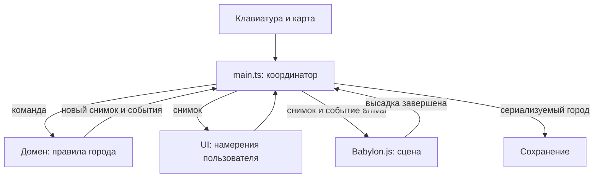

# Архитектура

Цель: новую экономическую механику можно проверить без видеокарты, а вид города — поменять без изменения правил заселения.

## Поток данных



`main.ts` знает обо всех модулях и соединяет их. Остальные модули не ищут друг друга в глобальных переменных. У домена нет зависимости от DOM, таймеров, localStorage или Babylon.js. Сцена получает функции географии через параметр `board`, а не импортирует внутреннее устройство игры.

## Границы

| Модуль | Публичный интерфейс | Чем владеет | Чего не делает |
| --- | --- | --- | --- |
| `domain/index.ts` | `createGame`, данные каталога, география, загрузка состояния | Население, деньги, здания, шаг обучения, допустимость действий | Не рисует и не сохраняет файл |
| Объект игры | `dispatch(command)`, `snapshot()`, `serialize()` | Единственное изменяемое состояние города | Не отдаёт наружу изменяемые ссылки |
| `persistence/index.ts` | `createStorage(getStorage)` → `load`, `save`, `loadSettings`, `saveSettings` | Доступ к сохранению и сообщения об ошибках | Не решает, сколько жителей приехало |
| `ui/index.ts` | `createUI(...)` → `render`, `notify`, `saveStatus`, `dispose` | DOM и обработчики кнопок | Не списывает стоимость строительства |
| `input/index.ts` | `bindInput(...)` → функция отключения | Различение клика и перетаскивания | Не решает, разрешено ли строить |
| `scene/index.ts` | `createScene(...)` → `setModel`, `playArrival`, `setPaused`, `setSettings`, `reset`, камера, `pick`, `dispose` | Babylon.js, GPU-ресурсы, кадры, подсветка | Не меняет население и казну |

Файлы внутри папки могут импортировать друг друга. Соседний слой использует только `index.ts`. Этот договор проверяет `tests/architecture.test.js`.

## Главное меню, пауза и настройки

`ui/menu.ts` экспортируется через `ui/index.ts`. Он управляет главным меню, диалогами паузы, настроек и подтверждения сброса. Сам город не изменяет: намерения `start`, `restart`, `pause`, `settings` получает координатор. `createUI` по-прежнему рисует игровой интерфейс, помощь и финальное письмо.

Фон меню — `assets/art/main-menu-loop.mp4`: бесшумный 30-секундный ролик, 24 кадра/с. `scripts/build.mjs` встраивает видео и исходную иллюстрацию `assets/art/main-menu.webp` как data URL; сетевых запросов нет. `ui/menu.ts` запускает видео только в видимом главном меню, если разрешена анимация и не включён `prefers-reduced-motion`. При входе в игру и скрытии вкладки видео останавливается; при ошибке остаётся иллюстрация. Исходный ответ генератора сохранён отдельно как `assets/art/main-menu-source.mp4`. Название игры, описание, прогресс и кнопки собраны в одной бумажной карточке по центру экрана. Оба слова заголовка используют единый шрифт и начертание; текст не накладывается непосредственно на иллюстрацию. Фон слегка тонируется через `--menu-art-overlay` в теме. Карточка остаётся HTML, игровые модели не меняются. Промпт и визуальные ориентиры сохранены в `assets/art/README.md`.

При загрузке координатор читает город и настройки, но не создаёт сцену и не подключает игровой ввод. До нажатия «Новая игра» / «Продолжить» нет ни WebGL-контекста, ни цикла кадров. Первый вход создаёт сцену, последующие используют её же. Валидный сохранённый город или первый успешный вход дают подпись «Продолжить». Само чтение меню ничего не записывает в сохранение.

На паузе игровой ввод отключается, `setPaused(true)` отменяет цикл кадров. Возобновление сдвигает начало рейса на длительность паузы; население и доход не пересчитываются. Меню, открытое поверх города, и выход в главное меню используют один механизм. Сцену не уничтожаем, поэтому сохраняются камера и положение корабля. Диалоги обрабатывают Escape от верхнего уровня: подтверждение → настройки → пауза → город.

Настройки хранятся под отдельным ключом `quiet-harbor-settings-v1`; версия и ключ города не меняются. `GameSettings` описывает качество графики, декоративную анимацию и подсказки. `setSettings` меняет плотность пикселей, частоту кадров и анимацию сцены, а `data-hints` на `body` управляет письмами после обучения. Цели и финальное действие не скрываются. Сброс города не сбрасывает настройки. Повреждённые настройки возвращают значения по умолчанию; запрет записи выводит предупреждение.

## Команды и события

Команда выражает намерение, а не гарантированное изменение:

```js
{ type: 'select', building: 'house' }
{ type: 'build', x: 7, z: 6 }
{ type: 'next-day' }
{ type: 'continue' }
{ type: 'reset' }
{ type: 'arrival-finished' }
```

`dispatch` возвращает `{ changed, events }`. `changed` означает изменение сохраняемого города. Выбор карточки меняет интерфейс, но не требует записи на диск. Ошибка размещения возвращает событие `notice`, не повреждая состояние.

`arrival` содержит число пассажиров и координаты порта. Это сообщение домена сцене: «покажи произошедшее». В обратную сторону идёт только `arrival-finished`: «анимация закончилась, можно продолжать».

## Три вида состояния

1. **Постоянное:** день, деньги, еда, население, здания, обучение, летопись. Попадает в `serialize()`.
2. **Сеансовое:** выбранная карточка и блокировка действий на время рейса. Живёт внутри объекта игры, но не в сохранении.
3. **Визуальное:** положение камеры, подсвеченная клетка, секунды анимации. Живёт только в сцене и input.

Число жителей увеличивается до начала визуальной высадки. Затем состояние сразу сохраняется. Поэтому перезагрузка во время анимации показывает уже заселившийся город, не повторяет начисление и не оставляет кнопку дня заблокированной.

## Графика и ресурсы

`geometry.ts` собирает здания из деталей Kenney и создаёт `VertexData`, который применяется к Babylon Mesh. Геометрия острова обновляется только после изменения построек. Корабль — отдельный `Mesh`, его движение не требует пересборки острова. При замене геометрии старая освобождается через `dispose()`. Первый кадр повторяется до готовности асинхронно компилируемых шейдеров; после этого неподвижная сцена перерисовывается только при изменениях.

`voyage.ts` считает положение по прошедшему времени. Он не знает ни о браузере, ни о жителях в сохранении. `life.ts` держит фиксированный пул 3D-фигур пассажиров и жителей, а также дым. Фигуры учитывают глубину сцены. Это декоративный слой, не полноценная логистика. Блики на воде и свет маяка рисуются на прозрачном 2D-слое.

`window.cityDebug` — узкий диагностический интерфейс только для чтения. Он возвращает копии и помогает сквозным тестам найти клетку на экране; приложение не использует его для общения модулей.

## История и гавань

`domain/story.ts` вычисляет главу и готовность к финалу по снимку города. Команда `light-beacon` проверяет условия ещё раз в домене, списывает 300 монет, записывает `won` и `completedDay`. UI не присваивает победу. Пока финальное письмо не прочитано, город не принимает строительные команды; `continue-city` сохраняет `endingSeen`, после чего продолжается обычная игра. Версия сохранения 4 читает версии 2 и 3.

`scene/harbor.ts` вычисляет расположение широкой набережной в море. Этой же геометрией пользуется рейс, поэтому корабль подходит к концу нового пирса. Порт занимает прежнюю береговую клетку, его морская часть не перекрывает соседнюю сушу. Маяк и новый облик города зависят от `won`; перезагрузка не стирает памятник победе.
