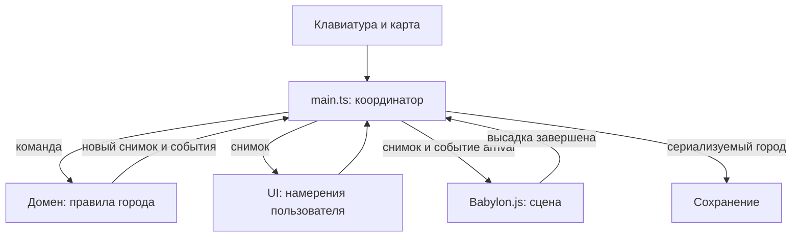

# Архитектура

Цель: новую экономическую механику можно проверить без видеокарты, а вид города — поменять без изменения правил заселения.

## Поток данных



`main.ts` знает обо всех модулях и соединяет их. Остальные модули не ищут друг друга в глобальных переменных. У домена нет зависимости от DOM, таймеров, localStorage или Babylon.js. Сцена получает функции географии через параметр `board`, а не импортирует внутреннее устройство игры.

## Границы

| Модуль | Публичный интерфейс | Чем владеет | Чего не делает |
| --- | --- | --- | --- |
| `domain/index.ts` | `createGame`, данные каталога, география, загрузка состояния | Население, деньги, здания, шаг обучения, допустимость действий | Не рисует и не сохраняет файл |
| Объект игры | `dispatch(command)`, `snapshot()`, `serialize()` | Единственное изменяемое состояние города | Не отдаёт наружу изменяемые ссылки |
| `persistence/index.ts` | `createStorage(getStorage)` → `load`, `save` | Доступ к сохранению и сообщения об ошибках | Не решает, сколько жителей приехало |
| `ui/index.ts` | `createUI(...)` → `render`, `notify`, `saveStatus`, `dispose` | DOM и обработчики кнопок | Не списывает стоимость строительства |
| `input/index.ts` | `bindInput(...)` → функция отключения | Различение клика и перетаскивания | Не решает, разрешено ли строить |
| `scene/index.ts` | `createScene(...)` → `setModel`, `playArrival`, `reset`, камера, `pick`, `dispose` | Babylon.js, GPU-ресурсы, кадры, подсветка | Не меняет население и казну |

Файлы внутри папки могут импортировать друг друга. Соседний слой использует только `index.ts`. Этот договор проверяет `tests/architecture.test.js`.

## Команды и события

Команда выражает намерение, а не гарантированное изменение:

```js
{ type: 'select', building: 'house' }
{ type: 'build', x: 7, z: 6 }
{ type: 'next-day' }
{ type: 'continue' }
{ type: 'reset' }
{ type: 'arrival-finished' }
```

`dispatch` возвращает `{ changed, events }`. `changed` означает изменение сохраняемого города. Выбор карточки меняет интерфейс, но не требует записи на диск. Ошибка размещения возвращает событие `notice`, не повреждая состояние.

`arrival` содержит число пассажиров и координаты порта. Это сообщение домена сцене: «покажи произошедшее». В обратную сторону идёт только `arrival-finished`: «анимация закончилась, можно продолжать».

## Три вида состояния

1. **Постоянное:** день, деньги, еда, население, здания, обучение, летопись. Попадает в `serialize()`.
2. **Сеансовое:** выбранная карточка и блокировка действий на время рейса. Живёт внутри объекта игры, но не в сохранении.
3. **Визуальное:** положение камеры, подсвеченная клетка, секунды анимации. Живёт только в сцене и input.

Число жителей увеличивается до начала визуальной высадки. Затем состояние сразу сохраняется. Поэтому перезагрузка во время анимации показывает уже заселившийся город, не повторяет начисление и не оставляет кнопку дня заблокированной.

## Графика и ресурсы

`geometry.ts` собирает здания из деталей Kenney и создаёт `VertexData`, который применяется к Babylon Mesh. Геометрия острова обновляется только после изменения построек. Корабль — отдельный `Mesh`, его движение не требует пересборки острова. При замене геометрии старая освобождается через `dispose()`. Первый кадр повторяется до готовности асинхронно компилируемых шейдеров; после этого неподвижная сцена перерисовывается только при изменениях.

`voyage.ts` считает положение по прошедшему времени. Он не знает ни о браузере, ни о жителях в сохранении. Пассажиры пока рисуются небольшими фигурами на прозрачном 2D-слое; их координаты проецируются той же камерой Babylon.js. Это осознанная граница текущего прототипа, не полноценная система пешеходов.

`window.cityDebug` — узкий диагностический интерфейс только для чтения. Он возвращает копии и помогает сквозным тестам найти клетку на экране; приложение не использует его для общения модулей.
