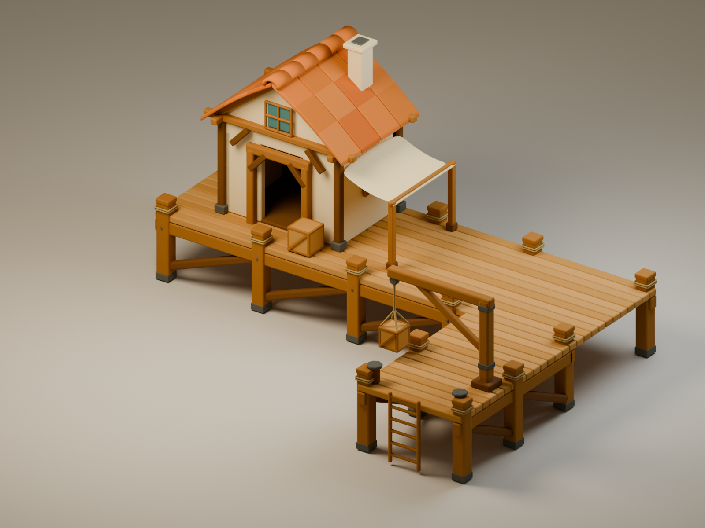

# Карта создаваемых 3D-моделей

Каталог собственных моделей «Тихой Гавани». Пути в [машинном каталоге](../assets/art/models.json) отсчитываются от корня репозитория. Обновлять обе карты при изменении исходника, статуса, экспорта или подключения модели. Купленные/скачанные наборы Kenney остаются в `assets/manifest.json` и своих папках; здесь учитываются модели, которые мы создаём сами.

| ID | Модель | Исходник | Превью | Статус | В игре |
| --- | --- | --- | --- | --- | --- |
| `starter-port` | Стартовый порт: дом, набережная, правый пирс, подъёмник | [port.blend](../assets/art/port-reference-simple/port.blend) | [Общий вид](../assets/art/port-reference-simple/beauty.png) · [4 ракурса](../assets/art/port-reference-simple/four-views.png) | Доработка внешнего вида; пользователь ещё не утвердил | Не подключён; игрового экспорта нет |
| `island-nature/pine-tall` | Высокая сосна | [GLB](../assets/models/island-nature/pine-tall.glb) | [В игре](../assets/models/island-nature/in-game-preview.png) | Готовая модель, 158 треугольников | `scene/environment.ts` |
| `island-nature/pine-wide` | Широкая сосна | [GLB](../assets/models/island-nature/pine-wide.glb) | [В игре](../assets/models/island-nature/in-game-preview.png) | Готовая модель, 158 треугольников | `scene/environment.ts` |
| `island-nature/pine-young` | Молодая сосна | [GLB](../assets/models/island-nature/pine-young.glb) | [В игре](../assets/models/island-nature/in-game-preview.png) | Готовая модель, 158 треугольников | `scene/environment.ts` |
| `island-nature/rock-large` | Крупная скала | [GLB](../assets/models/island-nature/rock-large.glb) | [В игре](../assets/models/island-nature/in-game-preview.png) | Готовая модель, 35 треугольников | `scene/environment.ts` |
| `island-nature/rock-flat` | Плоский камень | [GLB](../assets/models/island-nature/rock-flat.glb) | [В игре](../assets/models/island-nature/in-game-preview.png) | Готовая модель, 35 треугольников | `scene/environment.ts` |
| `island-nature/rock-small` | Малый камень | [GLB](../assets/models/island-nature/rock-small.glb) | [В игре](../assets/models/island-nature/in-game-preview.png) | Готовая модель, 35 треугольников | `scene/environment.ts` |
| `island-nature/bush` | Куст | [GLB](../assets/models/island-nature/bush.glb) | [В игре](../assets/models/island-nature/in-game-preview.png) | Готовая модель, 63 треугольников | `scene/environment.ts` |
| `island-nature/grass` | Пучок травы | [GLB](../assets/models/island-nature/grass.glb) | [В игре](../assets/models/island-nature/in-game-preview.png) | Готовая модель, 7 треугольников | `scene/environment.ts` |
| `island-nature/flowers` | Полевые цветы | [GLB](../assets/models/island-nature/flowers.glb) | [В игре](../assets/models/island-nature/in-game-preview.png) | Готовая модель, 27 треугольников | `scene/environment.ts` |

## starter-port — стартовый порт

- **Актуальный исходник:** [port.blend](../assets/art/port-reference-simple/port.blend). Единственная текущая 3D-модель; скрытый исходный блокинг сохранён внутри этого файла. Предыдущие состояния — в Git.
- **Стиль:** мягкие скругления, тёплая штукатурка, толстый деревянный каркас, объёмная терракотовая черепица. Один дом, боковой тканевый навес, широкий причал, правый пирс, грузовой подъёмник.
- **Визуальная цель:** [сгенерированный референс](../assets/art/port-reference-simple/design-reference.png). Это изображение, не дополнительная модель.
- **Правки и воспроизведение:** [промпты](../assets/art/port-reference-simple/prompts.txt), [исходный генератор](../assets/art/port-reference-simple/build_reference.py), [доработка формы](../assets/art/port-reference-simple/stylize_port.py). Генератор исторически запускает рендеры — не использовать его целиком для быстрой проверки. Стилевой проход изменяет геометрию без рендера.
- **Работа с открытой сценой:** изменения через Blender MCP; коллекция модели — `Port - shared geometry`. Камеры, свет и студийный фон находятся вне этой коллекции.
- **Масштаб и ориентация:** метры, X вдоль берега, +Y к суше, Z вверх; фасад к −Y. Габариты видимой модели примерно 12,10 × 8,46 × 6,30 м. При подключении к игре нужен отдельный выбор масштаба и опорной точки: в игре Y направлена вверх.

### Проверка готовности к игре — 11 октября 2026

Измерено через MCP без рендера и изменения сцены. [Машинный отчёт с SHA-256 исходника](../assets/art/port-reference-simple/model-audit.json).

| Показатель | Значение |
| --- | ---: |
| Треугольники с модификаторами viewport | 53 314 |
| Вершины с модификаторами viewport | 27 180 |
| Видимые части модели, включая кривые | 270 |
| Используемые материалы | 14 |
| Скрытые объекты исходного блокинга | 34 |
| Используемые изображения-текстуры | 0 |

Это **исходник для дальнейшего моделирования, пока не готовый игровой ассет**. Для единственного порта такая геометрия сама по себе ещё не доказывает проблему производительности. Нет замеров FPS/времени кадра в игре, а количество отдельных объектов не равно измеренному числу draw calls. Статистика относится к viewport-модификаторам, а не к финальному экспорту.

До подключения нужны:

1. Согласовать внешний вид, затем подготовить отдельную игровую геометрию: упростить незаметные фаски и канаты, объединить статические части, не потеряв характерный силуэт. Исключить скрытый блокинг, студию, камеры и свет из экспорта.
2. Выбрать путь передачи материалов и нормалей. Сейчас [сборщик ассетов](../scripts/pack-assets.mjs) переводит OBJ наборов Kenney в массивы позиций, треугольников и цветов. [Отрисовщик](../src/scene/geometry.ts) объединяет статическую геометрию, пересчитывает и сглаживает нормали для реального света; он не переносит авторские нормали и Blender-материалы как есть. Сам по себе экспорт в GLB не подключит порт к этому пути.
3. Подготовить экспорт и масштаб, проверить внешний вид и время кадра на целевом устройстве в наполненной игровой сцене. Уменьшение числа объектов особенно важно при отдельной загрузке мешей; существующее объединение геометрии уже сокращает число вызовов отрисовки.

Не делать автоматическую оптимизацию до согласования формы. Для итераций использовать быстрый viewport/Workbench/лёгкое Eevee. Превью выше уже существовали; при этой проверке новые рендеры не выполнялись.

## Более ранние визуальные варианты

- [Первый вариант порта](../assets/art/port-reference-v1/) — изображения и промпт, не 3D-модель.
- [Большой порт по береговому референсу](../assets/art/port-reference-waterfront/) — изображения и промпт, не 3D-модель.
- Текущий упрощённый вариант с одним домом — `starter-port`, описан выше.

## island-nature — набор окружения

[Общий вид в игре](../assets/models/island-nature/in-game-preview.png) · [Визуальный референс](../assets/art/island-reference.png) · [Игровые меши](../assets/models/island-nature/models.json) · [Генератор исходников](../scripts/create-nature-models.mjs)

Девять авторских низкополигональных моделей: три хвойных дерева, три камня, куст, трава и цветы. Всего 676 треугольников в библиотеке исходников; число треугольников окружения зависит от расстановки экземпляров (19 741 треугольник и 59 223 вершины для seed 123456789 без зданий после прохода 11 октября, включая землю, резные уступы и два пляжа; анимированная вода выделена в отдельную сетку).

GLB можно импортировать в Blender; JSON содержит те же вершины, треугольники и цвета палитры для автономной игры. Единицы соответствуют игровым; Y направлена вверх, основание объекта стоит в нуле. Никаких изображений-текстур, внешних запросов, скелетов или анимаций. Материал GLB матовый с vertex colors; в игре цвет освещают DirectionalLight и HemisphericLight, с сохранением плоских нормалей граней окружения. Исходные GLB не изменены. Художественный проход 11 октября применяет в игре более яркую палитру хвои и тёплого камня; рельеф с двумя плато, примерно 75% резных высоких бортов, два пологих пляжа и скальный берег из перекрывающихся объёмных глыб и глубоких расселин и расширенная в √2 территория формируются в `scene/environment.ts`, `scene/cliffs.ts`, `scene/cliff-layout.ts`, `scene/terrain.ts` и `scene/space.ts`. При расширении острова меняются расстояния между объектами, а деревья и камни сохраняют пропорции. Подводные основания камней удлинены только в игровой сборке.

Изменение модели: обновить `scripts/create-nature-models.mjs`, выполнить `node scripts/create-nature-models.mjs`, пересобрать игру, обновить этот каталог. Скрипт не выполняет рендеры. Игровой код читает готовую библиотеку, затем расставляет экземпляры по seed с независимыми координатами, поворотом и масштабом. При строительстве декор в пределах здания и прохода к порту исчезает; прочие экземпляры сохраняют положение.

## island-nature/cliff-rock — скалы берега и возвышенностей

[Генератор глыбы](../src/scene/cliffs.ts) · [Расстановка и контуры](../src/scene/cliff-layout.ts) · [Превью](../assets/models/island-nature/in-game-preview.png) · [Референс](../assets/art/coastal-reference/coast-3.png)

Процедурная глыба основана на форме `rock-large`: 42 треугольника и 126 вершин для уступов; 84 треугольника и 252 вершины для берегового варианта с четырьмя видимыми ярусами и подводным основанием. Оба варианта имеют плоские нормали и замкнутую геометрию; плечи неровные, наружная корона скошена. Отдельных `.blend` и GLB у этого варианта пока нет; он строится при сборке сцены и входит в общий буфер окружения. Размеры, повороты, наклон внутрь берега и высота плеча воспроизводимы по seed. Основные короны возвышенностей скрыты под травой; это проверяется на пяти seed.

Перекрывающиеся объёмные глыбы образуют видимые грани основного берега: узкие короны, четыре яруса неровных плеч, расширение к воде и глубокие стыки. Кромка травы отступает на 0,035 логической единицы внутрь каменного верха. Заглублённая общая поверхность закрывает промежутки; у воды остаются низкие отдельные валуны. Верх скального бока использует те же вершины, что и дёрн. Небольшой наклон сохраняет вертикальную массу; ватерлиния рассчитывается по сечениям самих глыб на Y=-0,68. Внутренние плато используют ту же форму с низкими передними глыбами; два пологих песчаных берега сохранены. Превью проверено в браузере без тяжёлого рендера. Статус — следующая художественная итерация, окончательное согласование владельцем не получено.

## island-nature/coast-surface — общий стык травы и скал

[Профиль и контур](../src/scene/cliff-layout.ts) · [Построение меша](../src/scene/environment.ts) · [Превью](../assets/models/island-nature/in-game-preview.png)

Процедурная поверхность берега: 192 сегмента, четыре пояса, 1536 треугольников. Верхние рёбра полностью совпадают с рёбрами травы; независимых щелей или нависающей зелёной кромки нет. Основа заглублена под объёмные глыбы и закрывает их стыки; видимый профиль задают ярусные экземпляры по 84 треугольника. Для seed 123456789 используется 31 береговая глыба. Два песчаных участка сохраняют пологий спуск. Отдельного `.blend`/GLB пока нет. Статистика общего окружения выше включает этот меш.
